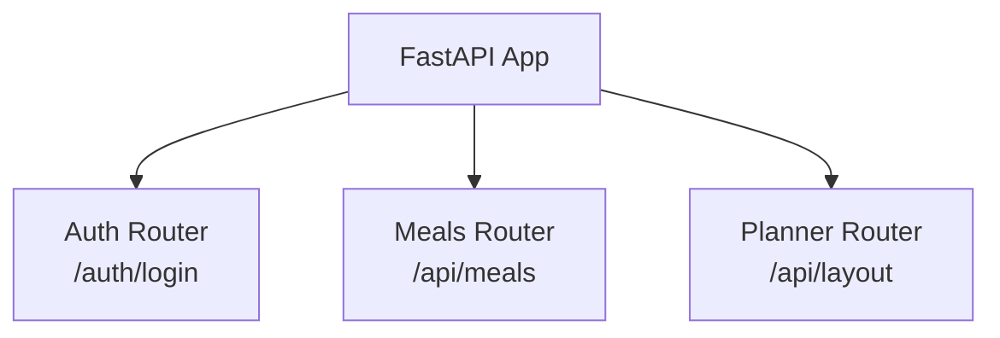

# SpoonFed
A complete nutrition delegation system

## Initial concept

SpoonFed as front end (to come later)
AutoMenu as back end (`automenu-api`)

### Back end plan



+ planning endpoint? (`/api/v1/plans/generate`)
+ External API Integration? (Edamam or USDA Food Data Central)

ORM choice: SQLAlchemy. SQLModel was taken into account, but I want to have more work to do on purpose, to have more opportunity to practice. Specifically, to practice Pydantic in this case.

Potential models:
- User: id, username, hashed_password, daily_calorie_target.
- Meal: id, name, calories, protein, carbs, fat, last_suggested_at.
- MealHistory: id, user_id, meal_id, date_consumed

## Quickstart

### Setup

After cloning the repo, make sure `uv` is installed.

```bash
uv sync
uv run pre-commit install
```

### Running the entire app

```bash
# Run the backend
uv run fastapi dev
```

## Concepts to use

- Pydantic validation
- URL parameters
- Filtering
- Swagger
- Docker (layers, multi-stage builds)
- Tests
- Cloud

## Inspirations

- [Paprika Recipe Manager](https://www.paprikaapp.com/)
- [Plan to Eat](https://www.plantoeat.com/)
- [Whisk / Samsung Food](https://samsungfood.com/)
- [Bring!](https://getbring.com/en/home)
- [Cebulko](https://cebulko.app/)
- [FeedMe](https://feed-me.app/)
